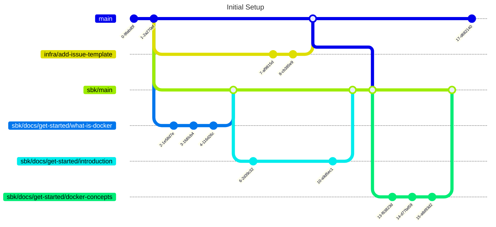

# Docker Basics

도커 기초 익히기

# How to learn

## 처음 시작하기

1. main branch 로부터 자신만의 main 브랜치를 생성한다.
   - 브랜치 이름은 다음과 같이 설정한다: 본인 이름/main
   - 예시: sbk/main

   1. main 브랜치로 checkout
      ```bash
      git checkout main
      ```
   2. 자신만의 main 브랜치 생성 및 체크아웃
      ```bash
      git checkout -b sbk/main
      ```
   3. 브랜치 생성 확인
      ```bash
      git branch
      ```
   4. 원격 저장소로 푸시하기
      ```bash
      git push -u origin sbk/main
      ```

## 진행하기

1. 한 주제에 대해 브랜치를 생성한다
   - 브랜치 이름은 다음과 같이 설정한다: 본인 이름/종류/브랜치 이름
   - 예시 브랜치 이름: sbk/docs/what-is-docker
   - sbk 가, 문서 작업 (주로 `.md` 파일), what-is-docker 내용 수정하는 브랜치
2. 해당 주제에 포함된 링크로 들어간다. (필요한 경우 브라우저의 번역 기능을 이용)
3. 마크다운을 이용해 페이지의 내용을 정리한다.
    - [깃허브 마크다운 안내](https://docs.github.com/ko/get-started/writing-on-github/getting-started-with-writing-and-formatting-on-github/basic-writing-and-formatting-syntax) (
      한국어 설정 가능)
    - 리스트나 테이블 등 적극 활용하기
4. Commit, push 그리고 pull request 를 생성한다.
   - PR 생성 시에 base 는 자신의 main 브랜치로 지정한다.
   - 예시: sbk/main <- sbk/docs/what-is-docker

## Git Graph



1. (최초) `main` 브랜치로부터 `사용자명/main` 브랜치 생성
2. `사용자명/main` 브랜치로부터 `사용자명/분류/대주제/소주제` 브랜치 생성
3. 커밋 해가며 작업
4. `사용자명/분류/대주제/소주제` 브랜치에서 `사용자명/main` 브랜치로 Pull Request 생성
5. 병합

## 진행 순서

- [해당 파일](./learnings/README.md)을 참조하여 진행

# Docker in GitHub

https://github.com/docker/build-push-action
https://github.com/docker/docker-credential-helpers
대충 깃허브 워크플로우에서 도커 쓰는 법

# buildx

https://github.com/docker/buildx

# Docker in Cloud: AWS ECS

ECS 로 도커 돌리는 법