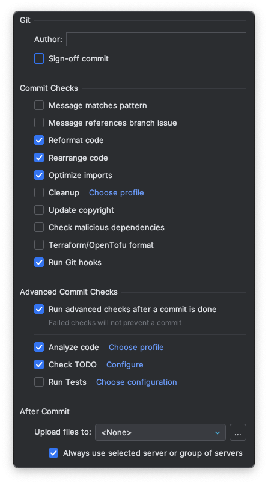

# Docker Basics

Docker Basics 는 Docker 를 학습하고 활용하기 위한 자율 스터디 공간입니다.

스터디는 다음과같이 진행됩니다:

- 공식 문서 기반 이론 학습: Docker 공식 문서를 읽고 이해한 내용을 본인만의 언어로 정리합니다.
- 실습 과정: (제작중)
- Pull Request 기반 자율 학습: 학습한 내용을 개인 main 브랜치로 병합하며 공유합니다.
- 주 1회 이상 참여 권장: 학습 분량에 상관없이 꾸준히 참여하는데 이의를 둡니다.

# 학습하기

이 단락에서는 Docker Basics 레포지토리를 사용하여 학습하는 방법을 설명합니다.

## 처음 시작하기

처음 시작하는 경우 `main` 으로부터 개인 main 브랜치를 생성하여야 합니다.

모든 학습 내용은 개인 main 브랜치에 병합하여 관리합니다.
`main` 브랜치는 레포지토리 전체에 대한 변경이 있을 경우 수정합니다.

> [!NOTE]
> `main` 브랜치란?: Git 으로 레포지토리를 생성할 때 생기는 기본 브랜치(default branch)입니다.

1. `main` 브랜치로부터 자신만의 main 브랜치를 생성한다.
   - 브랜치 이름은 다음과 같이 설정한다: *<본인_이름_이니셜>*/main
   - 예시: sbk/main
   1. main 브랜치로 checkout
      ```bash
      git checkout main
      ```
   2. 자신만의 main 브랜치 생성 및 체크아웃
      ```bash
      git checkout -b sbk/main
      ```
   3. 브랜치 생성 확인
      ```bash
      git branch
      ```
   4. 원격 저장소로 푸시하기
      ```bash
      git push -u origin sbk/main
      ```

## 진행하기

실제 학습을 진행할 때는 PR 생성을 위해 별도의 브랜치를 생성합니다.

1. 한 주제에 대해 브랜치를 생성한다.
   - 브랜치 이름은 다음과 같이 설정한다: 본인 <이니셜>/<종류>/<브랜치 이름>
   - 예시 브랜치 이름: sbk/docs/what-is-docker
      - sbk 가, 문서 작업 (주로 `.md` 파일), what-is-docker 내용 수정하는 브랜치
   - 필요한 경우 더 세분화해도 무방하다: sbk/docs/docker-concepts/registry
      - sbk 가, 문서 작업, docker-concepts 의 registry 단락을 수정하는 브랜치
2. 해당 주제에 포함된 링크로 들어간다. (필요한 경우 브라우저의 번역 기능을 이용)
3. 마크다운을 이용해 페이지의 내용을 정리한다.
    - [깃허브 마크다운 안내](https://docs.github.com/ko/get-started/writing-on-github/getting-started-with-writing-and-formatting-on-github/basic-writing-and-formatting-syntax) (
      한국어 설정 가능)
    - 리스트나 테이블 등 적극 활용하기
4. Commit, push 그리고 pull request 를 생성한다.
   - PR 생성 시에 base 는 자신의 main 브랜치로 지정한다.
   - 예시: sbk/main <- sbk/docs/what-is-docker
5. PR 이 병합될 수 있게 적극적으로 리뷰 및 변경 요청에 대한 대응을 한다.

## Git Graph


1. (최초) `main` 브랜치로부터 `사용자명/main` 브랜치 생성
2. `사용자명/main` 브랜치로부터 `사용자명/분류/대주제/소주제` 브랜치 생성
3. 커밋 해가며 작업
4. `사용자명/분류/대주제/소주제` 브랜치에서 `사용자명/main` 브랜치로 Pull Request 생성
5. 병합

## 진행 순서

- [해당 파일](./learnings/README.md)을 참조하여 진행

# 기여 가이드

## Git Hooks

[Git Hooks 공식 문서](https://git-scm.com/book/ms/v2/Customizing-Git-Git-Hooks)

Git Hooks 중 `commit-msg` hook 을 사용하여 메세지 내용 하단에 현재 작업중인 이슈 번호를 참조할 수 있습니다.

조건은 다음과 같습니다:

- 현재 작업중인 브랜치가 *카테고리/이슈 번호* (예: infra/123) 형식의 브랜치일 것
- 현재 커밋에 해당 이슈 번호가 참조되지 않았을 것

### Git Hooks 활성화 방법

일반적으로 Git Hooks 의 기본 경로는 `.git/hooks` 기 때문에 git 으로 공유되지 않습니다.

현 레포지토리에서는 `infra/git/hooks` 경로를 사용중입니다.
해당 경로로 Git Hooks 의 경로를 변경하기 위해서는 다음과 같은 설정이 필요합니다.

1. 아래의 명령어를 통해 Git Hooks 의 기본 경로를 레포지토리의 경로와 일치시킵니다.
   ```bash
   git config core.hooksPath infra/git/hooks
   ```

2. 아래의 명령어를 통해 해당 경로의 파일들이 실행 가능하게 합니다.
   ```bash
   chmod +x infra/git/hooks/*
   ```

3. JetBrains 제품에서 사용하는 방법:

- 위 과정을 정상적으로 진행한 경우 커밋 설정에서 활성화 가능
- 

# Docker in GitHub

https://github.com/docker/build-push-action
https://github.com/docker/docker-credential-helpers
대충 깃허브 워크플로우에서 도커 쓰는 법

# buildx

https://github.com/docker/buildx

# Docker in Cloud: AWS ECS

ECS 로 도커 돌리는 법